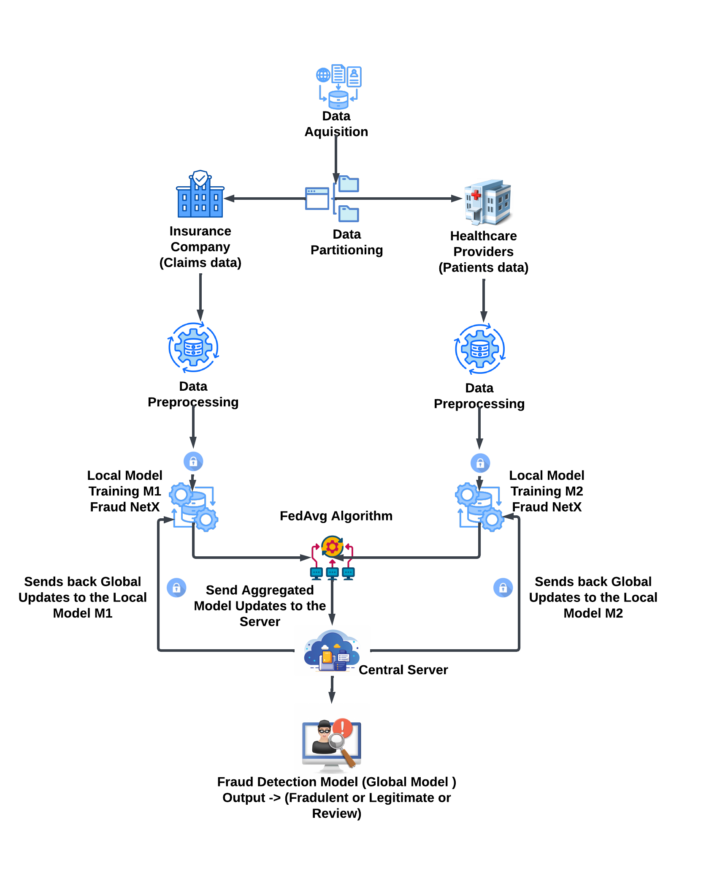

# VFL-Fraud-Detection
A VFL-based fraud detection system that enables hospitals and insurers to collaboratively train AI models without sharing raw data. The model combines medical and financial features using FFNN and Transformer Encoders, with FedAvg for secure aggregation and Differential Privacy to protect sensitive information.

# 📌 Knowing Without Showing: Vertical Federated Learning for Fraud Detection in Healthcare Insurance

## 🚀 Overview
This project implements a **privacy-preserving fraud detection system** for the healthcare insurance industry using **Vertical Federated Learning (VFL)**. The framework, named **FraudNetX**, allows hospitals and insurance companies to collaboratively train machine learning models without sharing sensitive patient or claim data.

## ✨ Features
- 🔐 **Vertical Federated Learning (VFL):** Allows institutions with different feature sets to jointly train a model.
- 🛡 **Differential Privacy (DP):** Adds noise to model updates to prevent data leakage.
- 🧠 **Hybrid Deep Learning Model:** Combines **Feedforward Neural Networks (FFNNs) and Transformer Encoders**.
- ⚖ **Federated Averaging (FedAvg):** Securely aggregates model updates from different institutions.
- 🔍 **Fraud Detection Decision Logic:** Classifies claims as **Legitimate, Review, or Fraudulent**.

## 💻 Hardware and Software Requirements
### 🔹 Hardware Requirements
- Processor: Intel Core i5/i7 or AMD equivalent
- RAM: Minimum 8GB (16GB recommended for larger datasets)
- GPU: NVIDIA GTX 1050 or higher (for deep learning acceleration)
- Storage: At least 20GB of free space

### 🔹 Software Requirements
- OS: Windows 10/11, Ubuntu 20.04+, or macOS
- Python 3.8+
- Required Libraries: `torch`, `pandas`, `numpy`, `scikit-learn`

## 📊 Dataset
The project uses a **publicly available healthcare fraud detection dataset** - [DataSet Link](https:/www.kaggle.com/datasets/rohitrox/healthcare-provider-fraud-detection-analysis)
- 🏥 **Hospital Data:** Contains patient medical records, including **StayDuration, UniqueDiagnosisCount**, and **risc_score**.
- 🏦 **Insurance Data:** Includes financial records such as **IPAnnualReimbursementAmt, OPAnnualReimbursementAmt**, and **claim_amount**.

## 🔧 Methodology
### 1️⃣ Data Preprocessing
   - Standardizes numerical features using `StandardScaler`.
   - Removes missing values.
   - Categorizes `risc_score` and `claim_amount` into **low, medium, and high** categories.

### 2️⃣ Local Model Training
   - Each party (hospital & insurance) trains a local **Feedforward Neural Network (FFNN) + Transformer model**.
   - Loss function: **Cross-Entropy Loss**.
   - Optimizer: **Adam**.

### 3️⃣ Federated Learning with Privacy
   - Hospitals and insurers train models independently.
   - **Federated Averaging (FedAvg)** aggregates model updates.
   - **Differential Privacy (DP)** protects model gradients before transmission.

### 🔍 Fraud Detection Decision Logic  
- 🏥 **Merges hospital risk scores** with 🏦 **insurance claim categories**.  
- ⚖ **Uses a rule-based system** to classify claims as ✅ **Legitimate**, 🔍 **Review**, or ❌ **Fraudulent**.  

## 🖼️ Architecture Diagram
The following diagram illustrates the **Vertical Federated Learning (VFL) workflow** in this project. The **hospital and insurance companies train their models locally** and send **securely encrypted updates** to a **central server** for aggregation using the **FedAvg algorithm**. The final **global model predicts fraudulent, legitimate, or review cases**.

## 📈 Results
- **🏥 Hospital Model Accuracy:** ~92.49%
- **🏦 Insurance Model Accuracy:** ~99.91%
- **⚖ Fraud Detection Performance:**
  - High recall for fraudulent claims.
  - Effective class imbalance handling using **adaptive class weighting**.

## 📊 Benchmark Comparison
| Model | Accuracy (%) | Precision (%) | Recall (%) | F1-Score (%) |
|--------|------------|------------|------------|------------|
| Logistic Regression | 93.16 | 80.39 | 39.05 | 52.56 |
| Decision Tree | 90.30 | 50.00 | 45.71 | 47.76 |
| Random Forest | 86.64 | 86.19 | 77.35 | 81.53 |
| **Hybrid FFNN + Transformer (Proposed)** | **99.91** | **99.92** | **99.91** | **99.94** |

## 🎯 Conclusion
FraudNetX successfully implements **privacy-preserving fraud detection** for healthcare insurance using **Vertical Federated Learning (VFL)**. The model achieves high accuracy while ensuring **data privacy** through **Differential Privacy (DP)** and **Federated Learning**.

---

